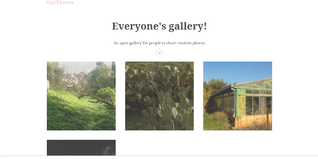

# OurPhotos
An open gallery for people to share random photos.

## Todo List
### Part One (version 1.0)
- [x] Add the readMe   
- [x] Create a form to upload photos (png, jpg) 
 - [x] Setting up the backend (Firebase)  
- [x] Store the photos on Firebase  
- [x] Style the gallery display  
- [x] Adding animation
### Part Two
- [ ]  Adding authentication
- [ ] Adding personal profil option

## Version 1.0 overview
- The user uploads a photo by selecting the "+" button.
- The new photo is displayed in a grid layout with all previous uploads.
- To show the original photo, the user can select any photo from the gallery.

 <h3>Overview of "OurPhoto" home page</h3>
  
 <h3>Upload photo screen</h3>
 
 <h3>Selecting photo (show original size)</h3>
 

## Technologies used
### React JS   
###  Firebase 
### Framer motion 

---
### This is a work in progress ✨
